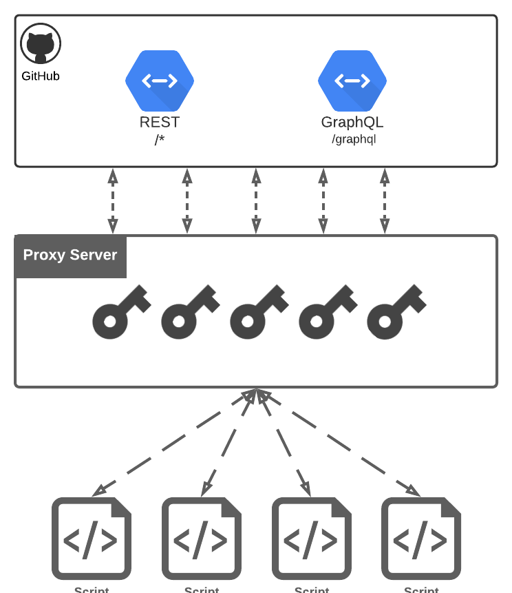

# 🖥️ GitHub Proxy Server

<br/><p align="center"><em>
GitHub Proxy Server is a tool to support developers and researchers collect massive amount of data from GitHub API (REST or GraphQL) by automatically managing access tokens and client requests to avoid triggering the GitHub API abuse detection mechanisms.
</em></p><br/>

**Why should I use it?** GitHub API has a limited number of requests per client and implements several mechanisms to detect user abuses. Thus, users must handle these restrictions in their applications. GitHub Proxy Server is a tool that abstracts these problems by means of a proxy server.

**When should I use it?** This tool is intended to be used by developers and researches that need to perform massive data collection of public repositories using both REST and GraphQL APIs.

**When should I <ins>not</ins> use it?** If you need to deal with private information of users and repositories this tool is not for you (see [limitations section](#limitations)).

**Can I use it with other libs?** Yes, as long they allow the users setup the proxy server as base url (see [samples](samples)).

**How it works?**

<p align="center">
  
</p>
<p align="center">Proxy Server Architecture</p>

## Features:

- Support to multiple access tokens

- Load balancing

- Rate limiter

- Customizable parameters

## Getting Started

You will need to install:

```bash
npm install -g gittrends-app/github-proxy-server
# or
yarn global add gittrends-app/github-proxy-server
```

## Usage

To use this tool you need to provide at least one GitHub access token:

```bash
github-proxy-server -p 3000 -t <access_token>
```

Or provide a file with several access token (one per line):

```bash
github-proxy-server -p 3000 --tokens <tokens.txt>
```

After that, just make the requests to http://localhost:3000 instead of https://api.github.com. For example:

```bash
curl -s http://localhost:3000/users/gittrends-app 2>&1
```

To more usage information, use the option `--help`.

```
Usage: index [options]

Options:
  -p, --port <port>               Port to start the proxy server (default: 3000)
  -t, --token <token>             GitHub token to be used (default: [])
  --api <api>                     API version to proxy requests (choices: "graphql", "rest", default: "graphql")
  --tokens <file>                 File containing a list of tokens
  --request-interval <interval>   Interval between requests (ms) (default: 250)
  --request-timeout <timeout>     Request timeout (ms) (default: 20000)
  --min-remaining <number>        Stop using token on (default: 100)
  --clustering                    Enable clustering mode (require redis)
  --clustering-redis-host <host>  (clustering) redis host (default: "localhost")
  --clustering-redis-port <port>  (clustering) redis port (default: 6379)
  --clustering-redis-db <db>      (clustering) redis db (default: 0)
  --silent                        Dont show requests outputs
  -v, --version                   output the current version
  -h, --help                      display help for command
```

## Limitations

GitHub Proxy Server was primarly intended to be a tool to support massive data collection of public repositories and users. To this purpose, we use a pool of access tokens to proxy requests to GitHub servers. For each request, we select the token with the lowest queue size and with more requests available.

Besides that, **we do not perform any verification on the clients requests, which may implies in security issues for the users who provided their tokens**.

To mitigate this problem, you can ensure that your access tokens are generated using only the necessary scopes (e.g., _public_repo_, _read:user_, etc.).

You may also ensure access to the proxy server only to users that you trust.

## Integrations

As mentioned, this tool can be used with serveral other libraries. You can find several examples in [samples](samples) folder.

## Contributing

Pull requests are welcome. For major changes, please open an issue first to discuss what you would like to change.

## License

[MIT](https://choosealicense.com/licenses/mit/)
