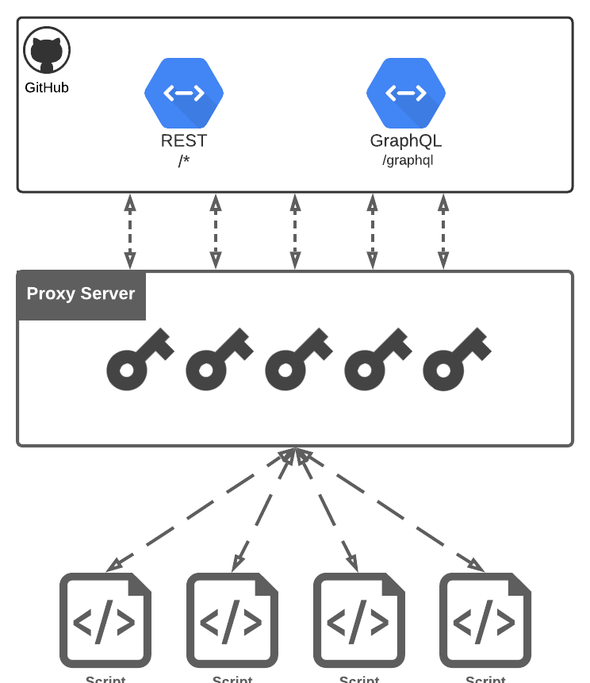

# 🖥️ GitHub Proxy Server

[](https://github.com/gittrends-app/github-proxy-server/actions/workflows/build.yml)
[](https://coveralls.io/github/gittrends-app/github-proxy-server)
[](https://badge.fury.io/gh/gittrends-app%2Fgithub-proxy-server)


<br/>

> GitHub Proxy Server is a tool to support developers and researchers collect massive amount of data from GitHub API (REST or GraphQL) by automatically managing access tokens and client requests to avoid triggering the GitHub API abuse detection mechanisms.

<br/>

**Why should I use it?** GitHub API has a limited number of requests per client and implements several mechanisms to detect user abuses. Thus, users must handle these restrictions in their applications. GitHub Proxy Server is a tool that abstracts these problems by means of a proxy server.

**When should I use it?** This tool is intended to be used by developers and researches that need to perform massive data collection of public repositories using both REST and GraphQL APIs.

**When should I <ins>not</ins> use it?** If you need to deal with private information of users and repositories this tool is not for you (see [limitations section](#limitations)).

**Can I use it with other libs?** Yes, as long they allow the users setup the proxy server as base url (see [samples](samples)).

**How it works?**

<p align="center">
  
</p>
<p align="center">Proxy Server Architecture</p>

## Features

- Support to multiple access tokens

- Load balancing

- Rate limiter

- Proxy authentication (HTTP Basic Auth)

- Customizable parameters

## Getting Started

First, you need to clone the repository:

```bash
git clone https://github.com/gittrends-app/github-proxy-server.git
```

Then, install dependencies, build files, and run the server:

```bash
yarn install
yarn build
yarn start --help
```

You can also build and run the Docker image directly:

```bash
docker build -t github-proxy-server https://github.com/gittrends-app/github-proxy-server.git#master
docker run --rm -it github-proxy-server --help
```

## Usage

To use this tool you need to provide at least one GitHub access token:

```bash
github-proxy-server -p 3000 -t <access_token>
```

Or provide a file with several access token (one per line):

```bash
github-proxy-server -p 3000 --tokens <tokens.txt>
```

After that, just make the requests to <http://localhost:3000> instead of <https://api.github.com>. For example:

```bash
curl -s http://localhost:3000/users/gittrends-app 2>&1
```

### Proxy Authentication

You can protect your proxy server with HTTP Basic Authentication:

```bash
github-proxy-server -p 3000 -t <access_token> --auth-username myuser --auth-password mypass
```

Or using environment variables:

```bash
GPS_AUTH_USERNAME=myuser GPS_AUTH_PASSWORD=mypass github-proxy-server -p 3000 -t <access_token>
```

Then make authenticated requests:

```bash
curl -s -u myuser:mypass http://localhost:3000/users/gittrends-app 2>&1
```

**Note:** `/status` and `/status/` are small public health endpoints and return `{"status":"ok"}`.
Unknown `/status/*` paths return `404` and never fall through to the proxy. Detailed swagger-stats
monitoring, when enabled, is isolated under `/metrics` (`/metrics/stats` and `/metrics/metrics`)
and is protected by Basic Authentication whenever proxy authentication is configured. Monitoring
paths return `404` when disabled; similarly prefixed routes such as `/status-other` still require
authentication.

When the proxy is deployed behind a trusted public URL, set `--external-base-url` or
`GPS_EXTERNAL_BASE_URL` to an absolute `http://` or `https://` URL. Redirect and `Link` headers are
rewritten to that base; if it is omitted, upstream links are preserved unchanged and the untrusted
inbound `Host` header is never used for external URLs.

Request bodies are limited to 1 MiB by default and can be configured with
`--max-request-body-bytes` or `GPS_MAX_REQUEST_BODY_BYTES` (1–16 MiB). Each live worker contributes
50 queue slots by default; configure this with `--max-queue-depth` or `GPS_MAX_QUEUE_DEPTH`.
Queued requests expire after 30 seconds by default (`--queue-wait-timeout` or
`GPS_QUEUE_WAIT_TIMEOUT`), and the total request lifetime is limited to 120 seconds by default
(`--request-lifetime-timeout` or `GPS_REQUEST_LIFETIME_TIMEOUT`). Body overflow returns `413`, a
full queue returns `503` with `Retry-After: 1`, and queue/lifetime expiry returns `504`.

### Deployment and TLS

The server listens for plain HTTP and binds to all interfaces when started by the CLI. Do not expose
that listener directly to an untrusted network: Basic Authentication credentials and proxied traffic
are not encrypted by this process. Put the server behind a trusted HTTPS/TLS termination boundary
when credentials or traffic cross an untrusted network. A local or private-network Docker health
check may continue to use `http://localhost:3000/status`; external health checks should use the
trusted HTTPS endpoint.

To more usage information, use the option `--help`.

```bash
Usage: index [options]

Options:
  -p, --port [port]                           Port to start the proxy server (default: 3000, env: PORT)
  -t, --token [token]                         GitHub token to be used (default: [])
  --tokens [file]                             File containing a list of tokens (env: GPS_TOKENS_FILE)
  --request-timeout [timeout]                 Request timeout (ms) (default: 30000, env: GPS_REQUEST_TIMEOUT)
  --min-remaining <number>                    Stop using token on a minimum of (default: 100, env: GPS_MIN_REMAINING)
  --max-request-body-bytes [bytes]            Maximum request body size (bytes) (default: 1048576, env: GPS_MAX_REQUEST_BODY_BYTES)
  --max-queue-depth [depth]                   Maximum queued requests per worker (default: 50, env: GPS_MAX_QUEUE_DEPTH)
  --queue-wait-timeout [timeout]              Maximum queue wait (ms) (default: 30000, env: GPS_QUEUE_WAIT_TIMEOUT)
  --request-lifetime-timeout [timeout]        Maximum request lifetime (ms) (default: 120000, env: GPS_REQUEST_LIFETIME_TIMEOUT)
  --time-budget-multiplier [multiplier]       Time budget multiplier (>= 1.0) (default: 1, env: GPS_TIME_BUDGET_MULTIPLIER)
  --external-base-url <url>                   Trusted external HTTP(S) base URL (env: GPS_EXTERNAL_BASE_URL)
  --silent                                    Dont show requests outputs (env: GPS_SILENT)
  --no-override-authorization                 By default, the authorization header is overrided with a configured token
  --auth-username [username]                  Proxy authentication username (env: GPS_AUTH_USERNAME)
  --auth-password [password]                  Proxy authentication password (env: GPS_AUTH_PASSWORD)
  --no-status-monitor                         Disable requests monitoring on /metrics
  -v, --version                               output the current version
  -h, --help                                  display help for command
```

## Limitations

GitHub Proxy Server was primarly intended to be a tool to support massive data collection of public repositories and users. To this purpose, we use a pool of access tokens to proxy requests to GitHub servers. For each request, we select the token with the lowest queue size and with more requests available.

Besides that, **we do not perform any verification on the clients requests, which may implies in security issues for the users who provided their tokens**.

To mitigate this problem, you can:

- Enable proxy authentication using `--auth-username` and `--auth-password` to restrict access to authorized clients only
- Ensure that your access tokens are generated using only the necessary scopes (e.g., _public_repo_, _read:user_, etc.)
- Restrict network access to the proxy server only to users that you trust

## Integrations

As mentioned, this tool can be used with serveral other libraries. You can find several examples in [samples](samples) folder.

## Contributing

Pull requests are welcome. For major changes, please open an issue first to discuss what you would like to change.

## License

[MIT](https://choosealicense.com/licenses/mit/)
