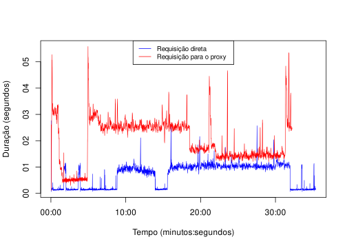
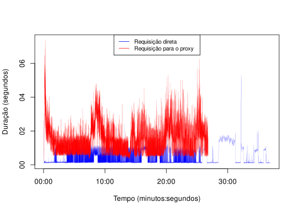

GitHub Proxy Server - Exemplo de Uso
================
Hudson Silva Borges
25 de Maio de 2022

## Introdução

Este script tem por objetivo reproduzir os passos necessários para
reprodução da análise realizada no artigo produzido e submetido para o
SBES 2022 - Sessão de Ferramentas.

Este arquivo R notebook tem como intenção principal facilitar a
registrar e facilitar a reprodução dos resultados obtidos e reportados
no trabalho. Detalhes da metodologia podem ser encontrados no artigo
submetido.

## Dependências

Para executar este arquivo é necessário possuir algumas dependências,
como, por exemplo, `anytime`. O código a seguir prepara o ambiente.

``` r
if(!require(anytime)){ install.packages("anytime") }
```

    ## Loading required package: anytime

``` r
library(anytime)

Sys.setenv(TZ=anytime:::getTZ()) ## helper function to try to get TZ
options(digits.secs=6)
options(scipen=999)
```

## Análise dos resultados do experimento

Inicialmente, a avaliação foi feita comparando o desempenho (medido em
tempo) usando somente um token de acesso. As requisições feitas
diretamente ao GitHub foram realziadas sequencialmente e as requisições
ao servidor proxy foram configuradas para serem realizadas em paralelo
uma vez que o mesmo é capaz de tratá-las de forma adequada. Sem seguida
avaliamos o desempenho usando três tokens de acesso diferentes. Os
resultados de cada um destes cenários são apresentados abaixo.

### Cenário 1: Somente um token de acesso

Os dados a seguir mostram um resumo da mineração executada usando
somente um token com requisições diretas ao serviço do GitHub.

``` r
requests_github_1w = read.csv(normalizePath(file.path('logs', 'requests_1g-1653435356283.csv')), header = T)
requests_github_1w$formatted_started_at = anytime(requests_github_1w$started_at / 1000)
requests_github_1w$formatted_finished_at = anytime(requests_github_1w$finished_at / 1000)

summary(requests_github_1w[, c('formatted_started_at', 'formatted_finished_at', 'duration')])
```

    ##  formatted_started_at             formatted_finished_at           
    ##  Min.   :2022-05-24 19:35:56.38   Min.   :2022-05-24 19:35:59.15  
    ##  1st Qu.:2022-05-24 19:40:50.09   1st Qu.:2022-05-24 19:40:50.23  
    ##  Median :2022-05-24 19:47:17.43   Median :2022-05-24 19:47:18.38  
    ##  Mean   :2022-05-24 19:50:54.81   Mean   :2022-05-24 19:50:55.18  
    ##  3rd Qu.:2022-05-24 20:02:35.26   3rd Qu.:2022-05-24 20:02:36.25  
    ##  Max.   :2022-05-24 20:11:18.07   Max.   :2022-05-24 20:11:18.20  
    ##     duration     
    ##  Min.   :  64.0  
    ##  1st Qu.: 132.0  
    ##  Median : 144.0  
    ##  Mean   : 361.2  
    ##  3rd Qu.: 735.5  
    ##  Max.   :2765.0

``` r
tmp.started_at = head(requests_github_1w$formatted_started_at, 1)
tmp.finished_at = tail(requests_github_1w$formatted_finished_at, 1)
print(tmp.finished_at -tmp.started_at)
```

    ## Time difference of 35.36367 mins

Considerando o uso de um único token e requisições ao servidor proxy.

``` r
requests_proxy_3w = read.csv(normalizePath(file.path('logs', 'requests_3p-1653437711187.csv')), header = T)
requests_proxy_3w$formatted_started_at = anytime(requests_proxy_3w$started_at / 1000)
requests_proxy_3w$formatted_finished_at = anytime(requests_proxy_3w$finished_at / 1000)

summary(requests_proxy_3w[, c('formatted_started_at', 'formatted_finished_at', 'duration')])
```

    ##  formatted_started_at             formatted_finished_at           
    ##  Min.   :2022-05-24 20:15:11.28   Min.   :2022-05-24 20:15:13.90  
    ##  1st Qu.:2022-05-24 20:19:29.85   1st Qu.:2022-05-24 20:19:30.41  
    ##  Median :2022-05-24 20:28:11.22   Median :2022-05-24 20:28:13.83  
    ##  Mean   :2022-05-24 20:29:07.22   Mean   :2022-05-24 20:29:09.00  
    ##  3rd Qu.:2022-05-24 20:37:36.00   3rd Qu.:2022-05-24 20:37:37.40  
    ##  Max.   :2022-05-24 20:47:21.56   Max.   :2022-05-24 20:47:24.05  
    ##     duration   
    ##  Min.   : 106  
    ##  1st Qu.:1218  
    ##  Median :1626  
    ##  Mean   :1780  
    ##  3rd Qu.:2539  
    ##  Max.   :5583

``` r
tmp.started_at = head(requests_proxy_3w$formatted_started_at, 1)
tmp.finished_at = tail(requests_proxy_3w$formatted_finished_at, 1)
print(tmp.finished_at -tmp.started_at)
```

    ## Time difference of 32.21275 mins

``` r
tmp.x1 = anytime((requests_github_1w$finished_at - head(requests_github_1w$started_at, 1)) / 1000)
tmp.y1 = anytime(requests_github_1w$duration / 1000)
tmp.x2 = anytime((requests_proxy_3w$finished_at - head(requests_proxy_3w$started_at, 1)) / 1000)
tmp.y2 = anytime(requests_proxy_3w$duration / 1000)
tmp.xlim = c(min(tmp.x1, tmp.x2), max(tmp.x1, tmp.x2))
tmp.ylim = c(min(tmp.y1, tmp.y2), max(tmp.y1, tmp.y2))
plot(tmp.y1 ~ tmp.x1, xlim = tmp.xlim, ylim = tmp.ylim, col = 'blue', pch=20, cex = .25, type = 'l', xlab = 'Tempo (minutos:segundos)', ylab = 'Duração (segundos)', lwd = 0.75)
lines(tmp.y2 ~ tmp.x2, col = 'red', pch=20, cex = .5, lwd = 0.75)
legend('top', legend = c('Requisição direta', 'Requisição para o proxy'), col = c('blue', 'red'), lty=1, cex=0.8)
```

<!-- -->

### Cenário 2: Usando três tokens de acesso

Nós também avaliamos a mesma tarefa dispondo de três tokens disponíveis.
A seguir seque o resumo das requisições realizadas diretamente ao
github.

``` r
requests_github_3w = read.csv(normalizePath(file.path('logs', 'requests_3g-1653446568445.csv')), header = T)
requests_github_3w$formatted_started_at = anytime(requests_github_3w$started_at / 1000)
requests_github_3w$formatted_finished_at = anytime(requests_github_3w$finished_at / 1000)

summary(requests_github_3w[, c('formatted_started_at', 'formatted_finished_at', 'duration')])
```

    ##  formatted_started_at             formatted_finished_at           
    ##  Min.   :2022-05-24 22:42:48.55   Min.   :2022-05-24 22:42:51.17  
    ##  1st Qu.:2022-05-24 22:48:37.69   1st Qu.:2022-05-24 22:48:38.08  
    ##  Median :2022-05-24 22:57:34.09   Median :2022-05-24 22:57:34.23  
    ##  Mean   :2022-05-24 22:57:48.73   Mean   :2022-05-24 22:57:49.00  
    ##  3rd Qu.:2022-05-24 23:04:48.99   3rd Qu.:2022-05-24 23:04:49.25  
    ##  Max.   :2022-05-24 23:19:43.64   Max.   :2022-05-24 23:19:43.75  
    ##     duration     
    ##  Min.   :  61.0  
    ##  1st Qu.: 127.0  
    ##  Median : 139.0  
    ##  Mean   : 278.3  
    ##  3rd Qu.: 159.0  
    ##  Max.   :5318.0

``` r
tmp.started_at = head(requests_github_3w$formatted_started_at, 1)
tmp.finished_at = tail(requests_github_3w$formatted_finished_at, 1)
print(tmp.finished_at -tmp.started_at)
```

    ## Time difference of 36.91992 mins

Considerando o uso de um único token e requisições ao servidor proxy.

``` r
requests_proxy_9w = read.csv(normalizePath(file.path('logs', 'requests_9p-1653487063109.csv')), header = T)
requests_proxy_9w$formatted_started_at = anytime(requests_proxy_9w$started_at / 1000)
requests_proxy_9w$formatted_finished_at = anytime(requests_proxy_9w$finished_at / 1000)

summary(requests_proxy_9w[, c('formatted_started_at', 'formatted_finished_at', 'duration')])
```

    ##  formatted_started_at             formatted_finished_at           
    ##  Min.   :2022-05-25 09:57:43.22   Min.   :2022-05-25 09:57:46.30  
    ##  1st Qu.:2022-05-25 10:03:53.61   1st Qu.:2022-05-25 10:03:54.66  
    ##  Median :2022-05-25 10:10:47.98   Median :2022-05-25 10:10:49.01  
    ##  Mean   :2022-05-25 10:10:42.27   Mean   :2022-05-25 10:10:43.70  
    ##  3rd Qu.:2022-05-25 10:16:58.00   3rd Qu.:2022-05-25 10:16:59.50  
    ##  Max.   :2022-05-25 10:24:31.56   Max.   :2022-05-25 10:24:32.13  
    ##     duration   
    ##  Min.   : 169  
    ##  1st Qu.: 672  
    ##  Median :1377  
    ##  Mean   :1424  
    ##  3rd Qu.:1826  
    ##  Max.   :7400

``` r
tmp.started_at = head(requests_proxy_9w$formatted_started_at, 1)
tmp.finished_at = tail(requests_proxy_9w$formatted_finished_at, 1)
print(tmp.finished_at -tmp.started_at)
```

    ## Time difference of 26.81508 mins

``` r
tmp.x1 = anytime((requests_github_3w$finished_at - head(requests_github_3w$started_at, 1)) / 1000)
tmp.y1 = anytime(requests_github_3w$duration / 1000)
tmp.x2 = anytime((requests_proxy_9w$finished_at - head(requests_proxy_9w$started_at, 1)) / 1000)
tmp.y2 = anytime(requests_proxy_9w$duration / 1000)
tmp.xlim = c(min(tmp.x1, tmp.x2), max(tmp.x1, tmp.x2))
tmp.ylim = c(min(tmp.y1, tmp.y2), max(tmp.y1, tmp.y2))
plot(tmp.y1 ~ tmp.x1, xlim = tmp.xlim, ylim = tmp.ylim, col = 'blue', pch=20, cex = .2, type = 'l', xlab = 'Tempo (minutos:segundos)', ylab = 'Duração (segundos)', lwd = 0.15)
lines(tmp.y2 ~ tmp.x2, col = 'red', pch=20, cex = .15, lwd = 0.2)
legend('top', legend = c('Requisição direta', 'Requisição para o proxy'), col = c('blue', 'red'), lty=1, cex=0.8)
```

<!-- -->
